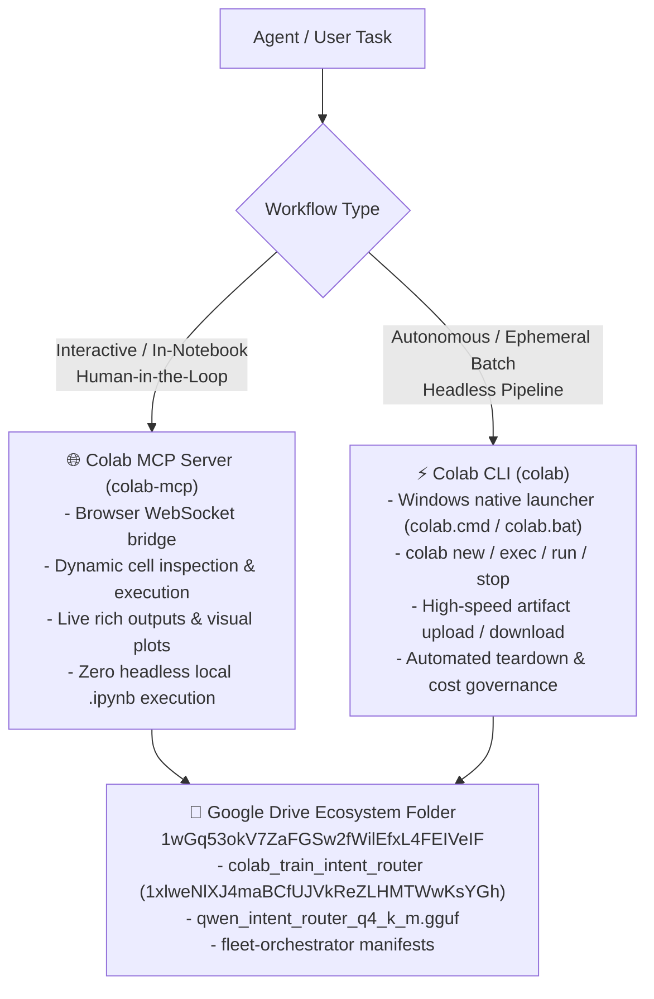

# Google Colab Cloud Accelerator (`colab-cloud-accelerator`)

This skill defines the authoritative architecture, protocols, and workflows for executing remote compute, training machine learning models, and interacting with Google Colab runtimes across Aaradhya's developer ecosystem.

---

## 1. Architectural Philosophy: The Dual Colab Gateway

Google Colab provides high-performance cloud compute (NVIDIA T4, L4, A100, and Google TPU v5e/v6e) without local hardware constraints or memory exhaustion. The ecosystem provides two complementary interfaces:



### Core Invariant
> **Jupyter Notebook Invariant**: *Never run or execute `.ipynb` files headlessly via local CLI commands; leave execution for Google Colab or manual runs.*
> Both `colab-mcp` and `colab` CLI uphold this invariant by running execution remotely on Google's cloud infrastructure.

---

## 2. Interface 1: Interactive Browser Workflows (`colab-mcp`)

The official Google Colab MCP server bridges local agents (Antigravity, Gemini CLI, Claude Code) to interactive sessions in the browser.

### MCP Configuration
Registered in `~/.gemini/antigravity/mcp_config.json`:
```json
"colab-mcp": {
  "command": "uvx",
  "args": ["git+https://github.com/googlecolab/colab-mcp"]
}
```

### Protocol & Lifecycle
1. **Initial Tool**: Call `open_colab_browser_connection` via `call_mcp_tool`.
2. **WebSocket Bridge**: The server spins up an ephemeral WebSocket server with an authentication token and opens Google Colab in the user's default browser.
3. **Targeting an Existing Notebook**: When working on an existing tracked notebook (such as `colab_train_intent_router`):
   ```
   https://colab.research.google.com/drive/1xlweNlXJ4maBCfUJVkReZLHMTWwKsYGh#mcpProxyToken=<token>&mcpProxyPort=<port>
   ```
4. **Dynamic Tool Injection**: Once the browser connects, Colab dynamically injects live tools (`notifications/tools/list_changed`):
   - Cell inspection and editing
   - Remote code execution on selected hardware (CPU/GPU/TPU)
   - Streamed stdout, stderr, and rich display evaluation

---

## 3. Interface 2: Autonomous Headless Pipelines (`colab` CLI)

The Google Colab CLI provides programmatic, terminal-based control over remote Colab VMs.

### Windows Native Support
On Windows, `colab.exe` is launched via the zero-friction wrapper (`colab` / `colab.bat` / `C:\Users\Aaradhya\.local\bin\colab.cmd` wrapping `tools/colab_cli_win.py`), which dynamically stubs Unix-only `termios`/`tty` console imports.

### Essential Commands

#### 1. Ephemeral One-Shot Jobs (`colab run`)
Provisions a VM, executes the script, downloads outputs, and automatically destroys the VM upon completion:
```powershell
colab run --gpu T4 script.py [args...]
colab run --gpu L4 --high-mem finetune_pipeline.py
```
- Exit codes propagate directly from the remote script to the local shell.
- Diagnostic logs go to stderr; script output goes to stdout.

#### 2. Persistent Multi-Step Sessions
When building up kernel state incrementally:
```powershell
# 1. Allocate session (Always pass -s <name>)
colab new -s router-forge --gpu L4

# 2. Install dependencies via uv inside VM (NEVER install xformers — uses native FlashAttention-2 / SDPA)
colab install -s router-forge unsloth peft bitsandbytes "trl<0.9.0"

# 3. Execute remote script
colab exec -s router-forge -f train_router.py

# 4. Download generated model / artifact
colab download -s router-forge /content/model.gguf ./models/model.gguf

# 5. Export execution log as standard notebook
colab log -s router-forge -o training_log.ipynb

# 6. Safety Teardown (Mandatory)
colab stop -s router-forge
```

#### 3. Attach Browser to Active CLI Session
Open the browser directly into an active CLI VM:
```powershell
colab url -s router-forge --open
```

---

## 4. Tracked Ecosystem Notebooks & Drive Integration

### The Router Forge Notebook (`colab_train_intent_router`)
- **Direct Colab URL**: [colab_train_intent_router](https://colab.research.google.com/drive/1xlweNlXJ4maBCfUJVkReZLHMTWwKsYGh)
- **Google Drive Permanent ID**: `1xlweNlXJ4maBCfUJVkReZLHMTWwKsYGh`
- **Parent Folder**: `Super-NLM / Fleet-Orchestrator` (`1wGq53okV7ZaFGSw2fWilEfxL4FEIVeIF`)
- **Local Mirror**: `notebooks/slm_time_router_forge.ipynb`
- **Tracked Manifest**: `drive-manifest.json`

### Training Workflow for Intent & Skill Router
1. **Model**: `unsloth/Qwen2.5-0.5B-Instruct-bnb-4bit`
2. **Dataset**: `intent_routing_train.jsonl` + `task_time_train.jsonl`
3. **Target Runtime**: Colab Pro **L4 GPU** (24GB VRAM) or Free **T4 GPU**
4. **Output Weights**: `q4_k_m` GGUF (~380 MB)
5. **Local Deployment**: LM Studio server at `localhost:1234` managed via `fast_intent_router.py`.

---

## 5. Cost & Resource Safety Rules

1. **Mandatory Teardown**: Always execute `colab stop -s <name>` or use `colab run` (which self-cleans) to prevent unattended compute unit burn.
2. **Session Name Invariant**: Always provide explicit `-s <name>` on `colab new` to prevent ambiguous random hex session IDs.
3. **No Interactive TTY in Headless Agents**: Never invoke `colab repl`, `colab console`, `colab auth`, or `colab drivemount` in non-interactive agent turns as they require a raw TTY.
4. **Programmatic Notebook Auto-Teardown (`runtime.unassign()`)**: All autonomous Colab training notebooks must conclude with a dedicated final cell executing `from google.colab import runtime; runtime.unassign()` after artifacts are persisted to Google Drive. This immediately releases high-cost GPU/TPU VMs (A100, L4) and cuts compute burn to `0.00/hr` the instant training finishes.
5. **Dynamic Cell Appending & FIFO Execution Queue Safety**: Appending, editing, or creating new cells (such as appending a teardown cell `runtime.unassign()`) while an earlier cell is actively executing has **zero effect** on in-flight training loops. The Jupyter `ipykernel` operates on an asynchronous FIFO ZeroMQ execution queue. To guarantee an appended cell executes automatically after preceding cells finish, click Run (Play button or `Shift + Enter`); Colab queues it with a pending indicator (`[*]`), ensuring hands-free teardown without interrupting active CUDA kernels or VRAM allocations.
6. **Unsloth GGUF Export Directory Suffix (`_gguf`)**: Unsloth's `model.save_pretrained_gguf(target_dir, ...)` automatically appends `_gguf` to the specified directory name (`target_dir_gguf/`). Cloud persistence code targeting mounted Google Drive must reference `f"{target_dir}_gguf"` or use dynamic glob discovery (`glob.glob("**/*.gguf", recursive=True)`) to eliminate `FileNotFoundError` upon training completion.
7. **Public Reader Sharing & Resumable CLI Model Retrieval (`gdown`)**: After uploading multi-gigabyte models (`.gguf`) to Google Drive, set sharing permissions to `role: reader, type: anyone` via the Drive MCP `share_file` tool. This allows zero-friction, authenticated or unauthenticated terminal downloads across local machines or worker nodes using:
   ```powershell
   python -m gdown --continue "https://drive.google.com/uc?id=<file_id>" -O "models/<filename>.gguf"
   ```
   `gdown` automatically handles Google Drive's large-file virus-scan confirmation bypass (`confirm=t`), and `--continue` guarantees resumable chunk transfer without corrupting existing downloads. Any interrupted transfer `.part` files should be purged immediately upon cancellation.


