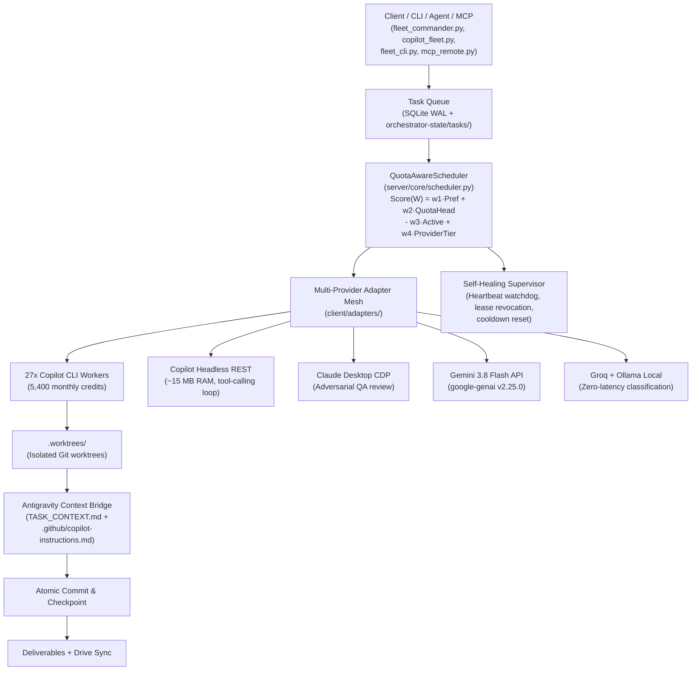

# Fleet-Orchestrator Swarm Control Skill

Operational commands, architectural guidelines, and execution workflows for **Fleet-Orchestrator** (`F:\Aaradhya-Dev-Tamrakar\Fleet-Orchestrator`), a production-grade autonomous multi-model agent fleet and swarm platform that pools heterogeneous AI compute models into a unified, high-concurrency autonomous swarm. **195 tests, 100% pass rate.**

---

## 1. Architecture Overview



### Core Systems

| Component | Location | Purpose |
|:---|:---|:---|
| **QuotaAwareScheduler** | `server/core/scheduler.py` | Multi-factor scoring: capability match, quota headroom, provider tier weight, concurrency penalty. Stage affinity bonuses (`+0.20` for code on Copilot CLI). |
| **PipelineEngine** | `server/core/pipeline_engine.py` | Decomposes jobs into DAG-staged tasks, manages stage advancement, QA gates, job finalization. |
| **ScratchpadManager** | `server/core/scratchpad_manager.py` | 3-section persistent Markdown shared state (Plan → Diffs → QA Verdict) with atomic `os.replace` writes and exclusive lock files. |
| **Supervisor** | `server/core/supervisor.py` | Self-healing loop: stale heartbeat detection (>120s), expired lease reclamation, cooldown timer resets. |
| **Credit Ledger** | `tools/credit_ledger.py` | Leaf accounting engine with OS file locks (`msvcrt`/`fcntl`), per-worker sidecar ledgers, `(file_size, mtime)` event cache, automatic month rollover. |
| **Antigravity Bridge** | `client/antigravity_bridge.py` | Harvests live chat state, conversation transcripts, active artifacts, and Antigravity customizations; projects `TASK_CONTEXT.md` + `.github/copilot-instructions.md` into worktrees. |
| **Remote MCP Server** | `server/mcp_remote.py` | 23-tool Streamable HTTP/SSE MCP server: `create_task`, `list_tasks`, `acquire_task`, `claim_task`, `renew_task_lease`, `submit_checkpoint`, `submit_qa_review`, `submit_job_from_template`, `register_worker`, `worker_heartbeat`, `push_memory`, `search_memory`, `read_team_context`, and more. |

### Multi-Provider Adapter Mesh (`client/adapters/`)

| Adapter | Class | Capabilities |
|:---|:---|:---|
| **Copilot CLI** | `CopilotCLIAdapter` | `copilot.exe --autopilot` with subprocess token injection, worktree sandboxing, `totalNanoAIU` credit parsing, usage file telemetry. |
| **Copilot Headless** | `CopilotHeadlessAdapter` | Pure async HTTP REST + OpenAI-compatible tool-calling loop (`read_file`, `write_file`, `run_command`). ~15 MB RAM per instance. |
| **Claude Desktop CDP** | `ClaudeDesktopCDPAdapter` | Chrome DevTools Protocol via WebSocket. DOM injection + WinPilot fallback. Model selection, thinking budget, cooldown detection. |
| **Claude Desktop Proxy** | `ClaudeDesktopProxyAdapter` | Higher-level Claude Desktop proxy with session management. |
| **Gemini API** | `GeminiAPIAdapter` | `google-genai` SDK v2.25.0. Gemini 3.8 Flash default. Deprecated model auto-mapping. Token usage telemetry extraction. |
| **Gemini Free** | `GeminiFreeAdapter` | Backward-compatible free-tier adapter. |
| **Groq** | `GroqAdapter` | Cloud Groq LLM API for fast formatting and classification. |
| **Ollama Local** | `OllamaLocalAdapter` | Local open-weight models via Ollama HTTP API. |
| **WinPilot Bridge** | `WinPilotBridge` | Win32 UI Automation bridge for physical desktop input coordination across Claude Desktop instances. |

---

## 2. CLI Commands & Operational Workflows

### Fleet Status & Account Health
```powershell
python tools/copilot_fleet.py status        # PAT readiness, credit headroom, per-worker status
python tools/copilot_fleet.py canary        # Concurrent canary ping across all 27 accounts
```

### Quota Reconciliation & Live Dashboard
```powershell
python tools/copilot_fleet.py reconcile     # Harvest authentic session logs into per-worker sidecars
python tools/copilot_fleet.py dashboard     # Real-time ASCII burn-rate meter & worker topology
python tools/copilot_fleet.py dashboard --json  # Machine-readable JSON telemetry
```

### Context-Firebreak Batch Execution (Fleet Commander)
Enforces `INV-CTX-FIREBREAK`: redirects child output to isolated logs, computes health ratio $H$, emits $\le 300$-word manifests.
```powershell
python tools/fleet_commander.py --specs "Implement feature A" "Refactor module B" --concurrency 2
python tools/fleet_commander.py --file tasks.json --dry-run
python tools/fleet_commander.py --specs "Task" --conversation-id <uuid>  # Inherit Antigravity context
python tools/fleet_commander.py --specs "Task" --no-antigravity          # Disable context inheritance
```

### Autonomous Task Submission & Batch
```powershell
python tools/copilot_fleet.py submit --spec "Implement X" --kind code
python tools/copilot_fleet.py batch --specs "Task 1" "Task 2" --concurrency 4
```

### Copilot Queue Worker (Background Daemon)
```powershell
python tools/copilot_queue_worker.py --concurrency 4                    # Poll & claim tasks
python tools/copilot_queue_worker.py --worker-id copilot-w1 --once      # Single task, specific worker
python tools/copilot_queue_worker.py --dry-run --task-id <id>           # Simulate without copilot.exe
python tools/copilot_queue_worker.py --no-worktree                      # Disable git worktree isolation
```

### Claude Desktop Fleet CLI
```powershell
python -m tools.fleet_cli status            # Active Claude Desktop instances & CDP health
python -m tools.fleet_cli broadcast "prompt" # Broadcast to all instances
python -m tools.fleet_cli send --profile user1 "prompt"  # Send to specific instance
python -m tools.fleet_cli submit --sku seo_content_batch  # Submit multi-stage job
```

### Fleet Control Center GUI v2.0
```powershell
.\launch_fleet_gui.bat                      # One-click launcher
python tools/fleet_gui.py                   # Direct launch
```
Tabs: Fleet Army Matrix (27 workers, filter chips) → Pipeline Tasks (status filtering, spec inspector) → Desktop Arranger (Win32 Virtual Desktop tiling) → Swarm Console (live event stream).

### Fast Intent Router (<50ms)
```powershell
python tools/fast_intent_router.py "dispatch swarm task across copilot fleet"
```
Routes via Qwen2.5-0.5B GGUF → LM Studio HTTP → heuristic fallback. Returns structured `{archetype, tier, matrix_cell, policy, primary_skill, velocity}`.

### SKU Task Dispatching
```powershell
python scripts/dispatch_iv_ii_tasks.py              # IV-II academic study packs
python scripts/dispatch_iv_ii_tasks.py --dry-run     # Preview without enqueuing
```

### Google Drive & NotebookLM Sync
```powershell
python scripts/sync_drive.py --push         # Push markdown to Google Drive (SHA-256 change detection)
python scripts/sync_drive.py --push --sync-nlm  # Also trigger NotebookLM source sync
python scripts/sync_drive.py --dry-run      # Preview changes without uploading
```
- **Drive Folder**: `1wGq53okV7ZaFGSw2fWilEfxL4FEIVeIF`
- **NotebookLM**: `6a37d992-6ceb-4d72-a909-e10e9cca32b6`

### FastAPI Server
```powershell
uvicorn server.main:app --host 0.0.0.0 --port 8000  # Start orchestration backend
```
REST API: `/api/v1/tasks`, `/api/v1/workers`, `/api/v1/jobs`, `/api/v1/memory`, `/api/v1/context`, `/api/v1/workers/quota-dashboard`. MCP endpoint: `/mcp`.

### One-Click Launchers
```powershell
.\launch_copilot_fleet.bat                  # Multi-account fleet launcher
.\launch_fleet_gui.bat                      # Fleet Control Center GUI v2.0
```

---

## 3. Verification & Testing

```powershell
pytest tests/                                           # Full 195-test suite
pytest tests/test_copilot_cli_adapter.py -v             # Adapter verification
pytest tests/test_copilot_headless.py -v                # Headless adapter tests
pytest tests/test_quota_reconciliation.py -v            # Credit ledger invariants
pytest tests/test_antigravity_bridge.py -v              # Context bridge tests
pytest tests/test_concurrency_stress.py -v              # Multi-worker race-freedom
pytest tests/test_e2e_pipeline.py -v                    # End-to-end DAG pipeline
```

---

## 4. Key Invariants & Best Practices

1. **Context Firebreak (`INV-CTX-FIREBREAK`)**: Never manage queues or poll logs directly from the main chat thread. Delegate batch workloads to Fleet Commander or ephemeral subagents. Keep parent context <5,000 tokens.
2. **Subprocess Isolation**: Every Copilot worker receives its own `COPILOT_GITHUB_TOKEN` and `COPILOT_HOME` directory. Never share credentials across processes.
3. **Worktree Hygiene**: All tasks execute inside ephemeral git worktrees under `.worktrees/`. Workers auto-commit changes, submit checkpoints, and tear down worktrees.
4. **Atomic Claims**: Task acquisition uses kernel-level `O_CREAT | O_EXCL` claim tokens (file-based queue) or SQLite compare-and-swap (server queue) to prevent double claims.
5. **Antigravity Context Projection**: When `--no-antigravity` is not set, Fleet Commander automatically harvests the active Antigravity conversation and projects `TASK_CONTEXT.md` + `.github/copilot-instructions.md` into each worktree.
6. **Credit Accounting**: The credit ledger (`tools/credit_ledger.py`) is a strict leaf module with zero repo imports. Uses OS file locks and `(file_size, mtime)` caching for authentic session-based accounting.
7. **Selective CI Bypass**: Use `.\sync.bat -SkipCI` for non-code changes. `sync.ps1` automatically detects non-code staged changes and appends `[skip ci]`.
8. **Version Control**: All commits via `.\sync.bat` — never raw `git add/commit/push`.

---

## 5. Directory Layout Reference

```
Fleet-Orchestrator/
├── server/                        # FastAPI backend + MCP remote (23 tools)
│   ├── main.py                    # App entrypoint & supervisor lifecycle
│   ├── mcp_remote.py              # Hosted Remote MCP Server (23 tools)
│   ├── api/                       # REST routes (jobs, tasks, workers, memory)
│   ├── core/                      # scheduler, supervisor, pipeline_engine, scratchpad_manager, auth, config, database, observability
│   ├── database/schema.sql        # 9-table SQLite WAL schema
│   ├── models/schemas.py          # Pydantic request/response models
│   └── Dockerfile                 # Container packaging
│
├── client/                        # Autonomous worker daemons & adapter mesh
│   ├── worker_daemon.py           # Polling daemon (registers, claims, executes)
│   ├── fleet_supervisor.py        # Multi-worker fleet supervisor with role capabilities
│   ├── antigravity_bridge.py      # Antigravity context harvesting & worktree projection
│   └── adapters/                  # 9 provider adapters (see §1 table)
│
├── tools/                         # CLI controllers & dashboards
│   ├── copilot_fleet.py           # Multi-account fleet controller (status/canary/dashboard/reconcile/submit/batch)
│   ├── copilot_queue_worker.py    # Background queue worker with worktree isolation
│   ├── fleet_commander.py         # Context-firebreak batch orchestrator (≤300 word manifests)
│   ├── fleet_cli.py               # Claude Desktop multi-instance fleet CLI
│   ├── fleet_gui.py               # Fleet Control Center v2.0 (Tkinter High-DPI GUI)
│   ├── fleet_watchdog.py          # Fleet health watchdog
│   ├── fast_intent_router.py      # Sub-50ms local Qwen GGUF intent router
│   ├── credit_ledger.py           # Leaf credit ledger with OS file locks
│   ├── ci_secret_scanner.py       # Pre-commit secret leakage scanner
│   ├── ci_self_healing_runner.py  # Self-healing test runner with flaky retries
│   ├── md2pdf_app.py              # Markdown to PDF desktop app
│   └── stress_test_concurrency.py # Multi-worker concurrency stress harness
│
├── scripts/                       # Dispatchers & sync engines
│   ├── dispatch_iv_ii_tasks.py    # IV-II academic study pack task dispatcher
│   ├── sync_drive.py              # Zero-dependency Google Drive sync (urllib + SHA-256)
│   └── upload_large_model_to_drive.py # Resumable chunked upload for ML models
│
├── mcp-servers/                   # Standalone MCP server packages
│   ├── orchestrator-mcp/          # Core orchestrator MCP
│   ├── cloud-orchestrator-mcp/    # Cloud orchestrator MCP
│   ├── md2pdf-mcp/                # Markdown→PDF MCP
│   ├── notebooklm-mcp/            # NotebookLM MCP
│   └── super-nlm-mcp/             # Super-NLM MCP
│
├── sku-templates/                 # Declarative DAG job templates
├── orchestrator-state/            # Live state (tasks/, checkpoints/, ledger/, scratchpads/, memory/, live-status/)
├── worker-prompts/                # 6 specialized role prompts (orchestrator, researcher, writer, qa-reviewer, seo-optimizer, formatter)
├── models/                        # Local GGUF model weights (git-ignored)
├── tests/                         # 195 automated pytest tests (29 test suites)
├── .github/workflows/             # CI (dynamic matrix), self-healing watchdog, Drive sync
├── .env.fleet.example             # Multi-account token template
├── drive-manifest.json            # Google Drive sync manifest with file IDs
├── sync.bat / sync.ps1            # Ecosystem sync with selective CI bypass
└── launch_fleet_gui.bat           # One-click GUI launcher
```
