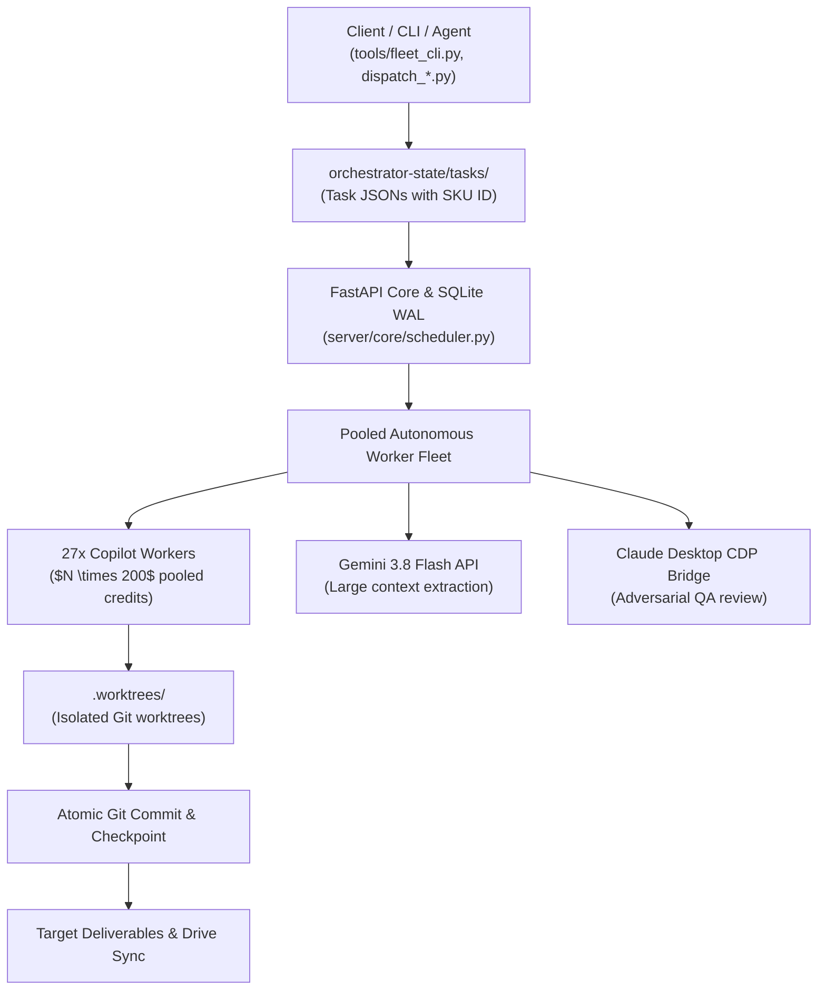

# Fleet-Orchestrator Swarm Control Skill

This skill provides operational commands, architectural guidelines, and execution workflows for operating **Fleet-Orchestrator** (`F:\Aaradhya-Dev-Tamrakar\Fleet-Orchestrator`), an autonomous multi-model agent fleet and swarm platform that pools heterogeneous AI compute models (GitHub Copilot CLI, Copilot Headless, Gemini 3.8 Flash API, Claude Desktop CDP, Groq, Ollama) into a unified, high-concurrency swarm.

---

## 1. Architectural Highlights



### Core Capabilities
1. **Multi-Account Credit Pooling ($N \times 200$)**:
   - Pools $N$ independent GitHub Copilot accounts into a shared quota pool (configured in `.env.fleet`).
   - Injects credentials per worker subprocess, eliminating 2FA challenges and credential collisions.
2. **Declarative SKU Pipeline DAGs (`sku-templates/`)**:
   - Expands multi-step batch jobs into dependency-ordered Directed Acyclic Graphs (`pipeline: ["research", "draft", "qa", "format"]`).
   - Example templates: `iv_ii_course_study_pack.json`, `document_processing_50.json`, `100_product_descriptions.json`.
3. **Task Queue & Atomic Leases**:
   - Tasks placed in `orchestrator-state/tasks/<task_id>.json` with status `"pending"`.
   - `copilot_queue_worker.py` acquires an atomic cryptographic lease token (`claim_token`), spawns an isolated git worktree, executes non-interactively, writes `orchestrator-state/checkpoints/<task_id>.json`, and marks the task `"done"`.
4. **Zero-Dependency Google Drive Sync**:
   - `scripts/sync_drive.py` maintains bidirectional sync with Google Drive and NotebookLM via `drive-manifest.json`.

---

## 2. Operational Workflows & CLI Commands

### Checking Fleet Health & Account Quotas
Inspect live Copilot pooled accounts, credit burn rate, and active worker statuses:
```powershell
python F:\Aaradhya-Dev-Tamrakar\Fleet-Orchestrator\tools\copilot_fleet.py status
```

### Launching the Autonomous Queue Worker
To start polling `orchestrator-state/tasks/` and claiming tasks:
```powershell
python F:\Aaradhya-Dev-Tamrakar\Fleet-Orchestrator\tools\copilot_queue_worker.py --workers 4
```

### Submitting Tasks via Declarative SKU
To enqueue tasks based on an existing SKU template:
```powershell
python F:\Aaradhya-Dev-Tamrakar\Fleet-Orchestrator\scripts\dispatch_iv_ii_tasks.py
```

### Running Google Drive & NotebookLM Sync
To push living markdown files to Google Drive preserving fileIds:
```powershell
python F:\Aaradhya-Dev-Tamrakar\Fleet-Orchestrator\scripts\sync_drive.py --push
```

---

## 3. Best Practices & Invariants

1. **Subprocess Isolation**: Never run long-running batch tasks directly on the main thread; always dispatch via `orchestrator-state/tasks/` or `copilot_queue_worker.py`.
2. **Worktree Hygiene**: Every task is executed inside an ephemeral git worktree under `.worktrees/`. The worker automatically commits changes upon completion and removes the worktree.
3. **Selective CI Bypass**: When syncing task queues, checkpoints, or documentation in `Fleet-Orchestrator`, always run `.\sync.bat` (which automatically passes `-SkipCI` / `-NoCI` to avoid expensive CI builds).
