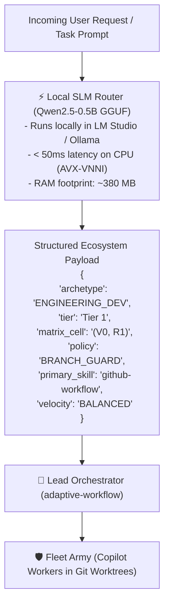

# SLM Router Forge (`slm-router-forge`)

This skill defines the authoritative procedure for synthesizing datasets, fine-tuning sub-1B parameter Small Language Models (SLMs) in Google Colab using Unsloth LoRA, exporting quantized INT4 GGUF weights, streaming large binary models directly to Google Drive via resumable upload, and mounting them locally into LM Studio for sub-50ms offline task routing.

---

## 1. Architectural Philosophy: The Decoupled Router Pattern

Frontier reasoning models (Gemini Pro, Claude Opus) should not waste expensive tokens or round-trip network latency on routine intent classification and skill routing. Instead, decouple execution into a dedicated 2-tier cognitive division:



---

## 2. The 5-Stage Forge Lifecycle

### Stage 1: Hardware Profiling & Architecture Selection
Before training, audit host memory and acceleration instructions to select the optimal model tier:
* **Host with <6 GB free RAM & Shared Graphics (e.g. Intel Core Ultra 7 155H, 16GB RAM)**:
  - **Optimal Tier**: **`Qwen2.5-0.5B-Instruct`** (Quantized to `Q4_K_M` GGUF: ~380 MB RAM, 25–45ms latency via AVX-VNNI).
  - **Alternative (Pure Logits)**: `SetFit / DeBERTa-v3-small` (86M: ~150 MB RAM, 8–12ms latency).
* **Host with Discrete NVIDIA GPU (>=8 GB VRAM)**:
  - **Optimal Tier**: `Qwen3.5-0.8B` or `Llama-3.2-1B-Instruct`.

---

### Stage 2: Grounded Dataset Synthesis & Task Time Harvesting
Synthesize instruction-tuning datasets grounded in real repository schemas, historical tasks, and empirical chat logs:
1. Ingest lifecycle archetypes from `references/lifecycle-stages.md`.
2. Map skills from `references/skill-matrix.md` and `.agents/skills/`.
3. Harvest real past task prompts and execution durations using `tools/harvest_task_time_dataset.py`:
   - Crawls 500+ transcripts in `~/.gemini/antigravity/brain/*/transcript.jsonl`.
   - Crawls task checkpoints in `Fleet-Orchestrator/orchestrator-state/checkpoints/*.json`.
4. Emit formatted `(instruction, input, output)` JSONL files:
   - `dataset/task_time_train.jsonl` (80% split)
   - `dataset/task_time_eval.jsonl` (20% split)

```json
{
  "instruction": "You are the high-speed Intent, Skill, and Task Time Allocation Router for the Aaradhya development ecosystem. Classify the incoming user intent into the exact lifecycle archetype, tier, 2D matrix cell, primary skill, supporting skills, velocity profile, and task time allocation (tier, estimated_duration_s, timeout_ceiling_s, cpm_weight, execution_route) in strict JSON format.",
  "input": "Fix the regression in test_warehouse_mem_sim.py where queue latency was calculating as zero.",
  "output": "{\"archetype\": \"ENGINEERING_DEV\", \"tier\": \"Tier 1\", \"matrix_cell\": \"(V0, R1)\", \"policy\": \"BRANCH_GUARD\", \"primary_skill\": \"github-workflow\", \"supporting_skills\": [\"systems-concurrency-harness\"], \"velocity\": \"BALANCED\", \"time_allocation\": {\"tier\": \"T1_FAST\", \"estimated_duration_s\": 35, \"timeout_ceiling_s\": 77, \"cpm_weight\": 1.17, \"execution_route\": \"DIRECT_FAST\"}}"
}
```

---

### Stage 3: Cloud GPU Fine-Tuning (Unsloth on Colab)
Execute fine-tuning on a cloud GPU (Colab Pro L4 Ada Lovelace or Free T4):
1. **Dependency Hygiene**:
   Avoid pinned xformers backtracking loops. Use clean wheel installation without `%%capture`:
   ```python
   !pip install --upgrade --no-cache-dir unsloth
   ```
2. **LoRA SFT Configuration**:
   - Model: `unsloth/Qwen2.5-0.5B-Instruct-bnb-4bit`
   - Rank: $r=16, \alpha=32$ across all linear projections (`q_proj, k_proj, v_proj, o_proj, gate_proj, up_proj, down_proj`)
   - Max Sequence Length: 1024
   - Epochs: 3 (typically ~135 gradient steps for 700 samples; finishes in ~90 seconds on L4 GPU)
3. **Export to INT4 GGUF**:
   ```python
   model.save_pretrained_gguf("qwen_intent_router_q4", tokenizer, quantization_method = "q4_k_m")
   ```
   *(Unsloth automatically outputs to `qwen_intent_router_q4_gguf/Qwen2.5-0.5B-Instruct.Q4_K_M.gguf`)*.

---

### Stage 4: Binary Isolation & Resumable Cloud Archiving
Never commit large binary model weights ($>100\text{ MB}$) to Git repositories:
1. **Strict `.gitignore` Invariant**:
   Enforce model ignores in repository roots:
   ```gitignore
   models/
   *.gguf
   *.safetensors
   *.bin
   *.onnx
   ```
2. **Chunked Resumable Upload to Google Drive**:
   Upload large weights directly to the designated Google Drive folder (e.g. `1wGq53okV7ZaFGSw2fWilEfxL4FEIVeIF`) using chunked resumable upload via `scripts/upload_large_model_to_drive.py`.
3. **Drive Manifest Registration**:
   Register the permanent Drive File ID and SHA-256 hash in `drive-manifest.json`:
   ```json
   "models/qwen_intent_router_q4_k_m.gguf": {
     "drive_file_id": "1bjXQ4K6hTtOevmG6XFih-AVGP0UlXGEK",
     "drive_file_name": "qwen_intent_router_q4_k_m.gguf",
     "description": "Fine-Tuned Qwen2.5-0.5B-Instruct Intent & Skill Router (Q4_K_M GGUF)",
     "sha256": "68e2824405149b24"
   }
   ```

---

### Stage 5: Local Silicon Serving & Execution Gate
Deploy the model locally for sub-50ms inference:
1. **LM Studio Import & Load**:
   ```powershell
   lms import -c --user-repo aaradhya/qwen-intent-router -y "models/qwen_intent_router_q4_k_m.gguf"
   lms server start
   lms load qwen-intent-router --identifier qwen-intent-router -y
   ```
2. **Client Health-Guarded Routing**:
   In `fast_intent_router.py`:
   - Perform a sub-millisecond socket connection check on `127.0.0.1:1234` before sending HTTP payloads.
   - If the server is offline, fall back instantly to deterministic keyword heuristics.
   - Set request timeout to 5.0 seconds.

---

## 3. Core Invariants (Zero-Drift Standards)

1. **INV-SLM-01: Zero Repo Bloat**: Machine learning binaries (`.gguf`, `.safetensors`, `.bin`) must never be staged or committed to Git. They reside in local cache (`models/`) and Google Drive cloud archives.
2. **INV-SLM-02: Socket Ping Guard**: Network requests to local inference servers must be guarded by a `<50ms` socket pre-check to eliminate multi-second connection timeouts when servers are cold.
3. **INV-SLM-03: Deterministic Fallback**: The client routing tool (`fast_intent_router.py`) must never fail or crash if the local LLM server is unbooted; it must return a valid heuristic classification with zero latency.
4. **INV-SLM-04: Resumable Cloud Ingestion**: All binary model uploads to Google Drive must use `uploadType=resumable` with 16MB chunking to prevent memory exhaustion and connection drops.
