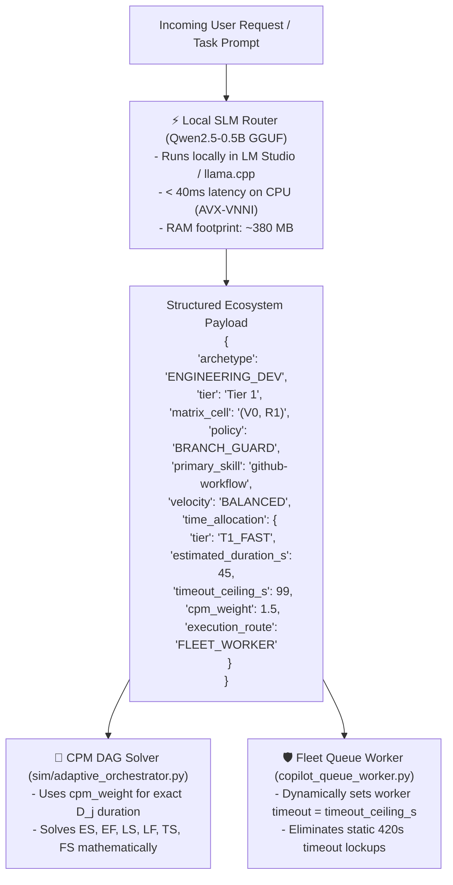

# SLM Router & Time Allocation Forge (`slm-router-forge`)

This skill defines the authoritative procedure for harvesting empirical task execution datasets from chat histories, fine-tuning sub-1B parameter Small Language Models (SLMs) in Google Colab (Pro L4 GPU or Free T4) using Unsloth LoRA, exporting quantized INT4 GGUF weights, streaming large binary models directly to Google Drive via direct drive mounting or resumable upload, and mounting them locally into LM Studio for sub-50ms offline task routing and dynamic time allocation.

---

## 1. Architectural Philosophy: The Decoupled Router & Time Allocation Pattern

Frontier reasoning models (Gemini Pro, Claude Opus) should not waste expensive tokens or round-trip network latency on routine intent classification, skill dispatching, and execution duration estimation. Instead, decouple execution into a dedicated 2-tier cognitive division:



---

## 2. The 5-Stage Forge Lifecycle

### Stage 1: Hardware Profiling & Architecture Selection
Before training, audit host memory and acceleration instructions to select the optimal model tier:
* **Host with <6 GB free RAM & Shared Graphics (e.g. Intel Core Ultra 7 155H, 16GB RAM)**:
  - **Optimal Tier**: **`Qwen2.5-0.5B-Instruct`** (Quantized to `Q4_K_M` GGUF: ~380 MB RAM, 25–45ms latency via AVX-VNNI).
  - **Alternative (Pure Logits)**: `SetFit / DeBERTa-v3-small` (86M: ~150 MB RAM, 8–12ms latency).
* **Host with Discrete NVIDIA GPU (>=8 GB VRAM)**:
  - **Optimal Tier**: `Qwen3.5-0.8B` or `Llama-3.2-1B-Instruct`.

---

### Stage 2: Grounded Multi-Task Dataset Synthesis (10,010 Samples)
Synthesize instruction-tuning datasets grounded in real repository schemas, historical tasks, empirical chat histories, and Fusemachines AI Fellowship standards:
1. Ingest lifecycle archetypes from `references/lifecycle-stages.md`.
2. Map skills from `references/skill-matrix.md` and `.agents/skills/`.
3. Harvest real past task prompts and execution durations using multi-stream mining tools:
   - `tools/harvest_cross_ide_transcripts.py`: Ingests 1,595 turns from VS Code SQLite (`Code/User/globalStorage/github.copilot-chat/session-store.db`), Claude Desktop exports, and Antigravity brain logs.
   - `tools/generate_best_practices_dataset.py`: Synthesizes 2,500 curriculum-aligned pairs from Fusemachines AI Fellowship (Weeks 1-17: S&P 500 forecasting, Telco churn, NEU steel defect CNN, FreshTrack, CLIP zero-shot, CRF NER, Agentic SLM, Dual-Track MLOps) and repo invariants.
   - `tools/harvest_copilot_counter_dataset.py`: Mines failure traces from `qa-reviews/copilot_mistakes/` for counter-example alignment.
   - `tools/build_unified_fleet_dataset.py`: Merges and deduplicates into the unified multi-task dataset:
     - `dataset/unified_fleet_train.jsonl` (8,008 samples, 80%)
     - `dataset/unified_fleet_eval.jsonl` (2,002 samples, 20%)
     - Total: **10,010 samples** covering intent routing, time allocation, 2D matrix policies, copilot auto-tier steering (`efficiency`, `balance`, `intelligence`), and architectural best practices.

```json
{
  "instruction": "You are the high-speed Intent, Skill, and Task Time Allocation Router for the Aaradhya development ecosystem. Classify the incoming user intent into the exact lifecycle archetype, tier, 2D matrix cell, primary skill, supporting skills, velocity profile, auto_tier, recommended_copilot_model, and task time allocation (tier, estimated_duration_s, timeout_ceiling_s, cpm_weight, execution_route) in strict JSON format.",
  "input": "Fix the regression in test_warehouse_mem_sim.py where queue latency was calculating as zero.",
  "output": "{\"archetype\": \"ENGINEERING_DEV\", \"tier\": \"Tier 1\", \"matrix_cell\": \"(V0, R1)\", \"policy\": \"BRANCH_GUARD\", \"primary_skill\": \"github-workflow\", \"supporting_skills\": [\"systems-concurrency-harness\"], \"velocity\": \"BALANCED\", \"auto_tier\": \"balance\", \"recommended_copilot_model\": \"copilot\", \"time_allocation\": {\"tier\": \"T1_FAST\", \"estimated_duration_s\": 35, \"timeout_ceiling_s\": 77, \"cpm_weight\": 1.17, \"execution_route\": \"DIRECT_FAST\"}}"
}
```

---

### Stage 3: Cloud GPU Fine-Tuning (Unsloth on Colab Pro / Free)
Execute fine-tuning on a cloud GPU (Colab Pro L4 Ada Lovelace, A100, or Free T4) using the verified self-contained notebook:

1. **Tracked Colab Notebooks**:
   - Primary self-contained notebook: `notebooks/slm_time_router_forge.ipynb` (in `Fleet-Orchestrator`)
   - Research experiment mirror: `research/experiments/colab_train_qwen_intent_router.ipynb` (in `brainstorm`)
   - Google Drive cloud mirror: `1wGq53okV7ZaFGSw2fWilEfxL4FEIVeIF`

2. **Environment Setup & Dependency Isolation**:
   ```python
   !pip install --upgrade --no-cache-dir "unsloth[colab-new] @ git+https://github.com/unslothai/unsloth.git"
   !pip install --no-deps "trl<0.9.0" peft accelerate bitsandbytes
   ```

3. **Model & LoRA Initialization (Unsloth 4-bit)**:
   ```python
   from unsloth import FastLanguageModel
   import torch

   max_seq_length = 1024
   dtype = None  # Auto-detects bfloat16 on L4 / A100
   load_in_4bit = True

   model, tokenizer = FastLanguageModel.from_pretrained(
       model_name = "unsloth/Qwen2.5-0.5B-Instruct-bnb-4bit",
       max_seq_length = max_seq_length,
       dtype = dtype,
       load_in_4bit = load_in_4bit,
   )

   model = FastLanguageModel.get_peft_model(
       model,
       r = 16,
       target_modules = ["q_proj", "k_proj", "v_proj", "o_proj", "gate_proj", "up_proj", "down_proj"],
       lora_alpha = 32,
       lora_dropout = 0,
       bias = "none",
       use_gradient_checkpointing = "unsloth",
       random_state = 42,
   )
   ```

4. **ChatML Formatting & Dataset Ingestion**:
   ```python
   import os
   from datasets import load_dataset

   train_file = "task_time_train.jsonl" if os.path.exists("task_time_train.jsonl") else "intent_routing_train.jsonl"
   eval_file = "task_time_eval.jsonl" if os.path.exists("task_time_eval.jsonl") else "intent_routing_eval.jsonl"

   dataset = load_dataset("json", data_files={"train": train_file, "eval": eval_file})

   def formatting_prompts_func(examples):
       instructions = examples["instruction"]
       inputs       = examples["input"]
       outputs      = examples["output"]
       texts = []
       for instruction, input_text, output in zip(instructions, inputs, outputs):
           text = f"<|im_start|>system\n{instruction}<|im_end|>\n<|im_start|>user\n{input_text}<|im_end|>\n<|im_start|>assistant\n{output}<|im_end|>"
           texts.append(text)
       return {"text": texts}

   dataset = dataset.map(formatting_prompts_func, batched = True)
   ```

5. **`transformers >= 4.47` & `trl < 0.9.0` Compatibility Bridge**:
   Modern `transformers` versions renamed `tokenizer` to `processing_class`. To avoid `TypeError: SFTTrainer.__init__() got an unexpected keyword argument` or `Trainer` initialization errors in Colab, enforce this patch before `SFTTrainer` initialization:
   ```python
   from trl import SFTTrainer
   from transformers import TrainingArguments, Trainer
   import unsloth.models._utils

   if hasattr(unsloth.models._utils, "_original_trainer_init"):
       _orig_unsloth_init = unsloth.models._utils._original_trainer_init
       def _patched_unsloth_init(self, *args, **kwargs):
           if "tokenizer" in kwargs and "processing_class" not in kwargs:
               tok = kwargs.pop("tokenizer")
               kwargs["processing_class"] = tok
               self.tokenizer = tok
           elif "tokenizer" in kwargs:
               self.tokenizer = kwargs.pop("tokenizer")
           return _orig_unsloth_init(self, *args, **kwargs)
       unsloth.models._utils._original_trainer_init = _patched_unsloth_init

   _orig_trainer_init = Trainer.__init__
   def _patched_trainer_init(self, *args, **kwargs):
       if "tokenizer" in kwargs and "processing_class" not in kwargs:
           tok = kwargs.pop("tokenizer")
           kwargs["processing_class"] = tok
           self.tokenizer = tok
       elif "tokenizer" in kwargs:
           self.tokenizer = kwargs.pop("tokenizer")
       return _orig_trainer_init(self, *args, **kwargs)
   Trainer.__init__ = _patched_trainer_init
   ```

6. **Adaptive Hardware Hyperparameters (L4 vs T4)**:
   ```python
   has_bf16 = torch.cuda.is_bf16_supported()
   batch_size = 8 if has_bf16 else 4
   grad_accum = 2 if has_bf16 else 4

   trainer = SFTTrainer(
       model = model,
       tokenizer = tokenizer,
       train_dataset = dataset["train"],
       eval_dataset = dataset["eval"],
       dataset_text_field = "text",
       max_seq_length = max_seq_length,
       dataset_num_proc = 2,
       packing = False,
       args = TrainingArguments(
           per_device_train_batch_size = batch_size,
           gradient_accumulation_steps = grad_accum,
           warmup_steps = 10,
           num_train_epochs = 3,
           learning_rate = 2e-4,
           fp16 = not has_bf16,
           bf16 = has_bf16,
           logging_steps = 15,
           optim = "adamw_8bit",
           weight_decay = 0.01,
           lr_scheduler_type = "linear",
           seed = 42,
           output_dir = "outputs",
       ),
   )
   trainer_stats = trainer.train()
   ```
   *(Training takes **~60 to 90 seconds** on L4 GPU for 1,553 samples across 3 epochs)*.

7. **Structured Inference Verification Gate**:
   Always run test validation with `FastLanguageModel.for_inference(model)` and verify strict JSON decoding on test prompts:
   ```python
   import json
   FastLanguageModel.for_inference(model)

   sys_prompt = "You are the high-speed Intent, Skill, and Task Time Allocation Router for the Aaradhya development ecosystem. Classify the incoming user intent into the exact lifecycle archetype, tier, 2D matrix cell, primary skill, supporting skills, velocity profile, and task time allocation (tier, estimated_duration_s, timeout_ceiling_s, cpm_weight, execution_route) in strict JSON format."

   test_prompts = [
       "Fix the regression in test_warehouse_mem_sim.py where queue latency was calculating as zero.",
       "Scaffold IOE BE semester IV-II notes for CE 752 and EX 756 with syllabus markdown hubs.",
       "Dispatch autonomous fleet swarm across 27 workers to implement parallel unit tests.",
       "Add a new project card to access.js and re-encrypt with AES-256-GCM.",
       "Audit system memory and check git status."
   ]

   for prompt in test_prompts:
       prompt_text = f"<|im_start|>system\n{sys_prompt}<|im_end|>\n<|im_start|>user\n{prompt}<|im_end|>\n<|im_start|>assistant\n"
       inputs = tokenizer([prompt_text], return_tensors = "pt").to("cuda")
       outputs = model.generate(**inputs, max_new_tokens = 220, use_cache = True)
       res = tokenizer.batch_decode(outputs)[0].split("<|im_start|>assistant\n")[-1].replace("<|im_end|>", "").strip()
       parsed = json.loads(res)  # Must strictly parse as valid JSON
   ```

---

### Stage 4: Binary Export & Dual Model Packaging Pathways
Never commit large binary model weights ($>100\text{ MB}$) to Git repositories. Choose between two verified model formats:

1. **Pathway A: Quantized INT4 GGUF (`Q4_K_M`) for CPU AVX-VNNI**:
   ```python
   model.save_pretrained_gguf("qwen_intent_router_q4", tokenizer, quantization_method = "q4_k_m")
   ```
   *(Outputs quantized GGUF weights `qwen_intent_router_q4_gguf/Qwen2.5-0.5B-Instruct.Q4_K_M.gguf` (~380 MB) for LM Studio and llama.cpp)*.

2. **Pathway B: OpenVINO IR INT4 for Intel NPU / Arc iGPU Acceleration**:
   Convert the fine-tuned checkpoint directly to OpenVINO Intermediate Representation (IR) INT4 via `optimum-intel` / `openvino-genai`:
   ```bash
   optimum-cli export openvino --model ./fine_tuned_checkpoint --weight-format int4 ./openvino_qwen_int4
   ```
   *(Outputs `openvino_model.xml`, `openvino_model.bin`, and tokenizer configs for zero-CPU Intel NPU offloading)*.

3. **Cloud Persistence via Google Drive**:
   Mount Google Drive directly in Colab and copy artifacts to the designated Fleet-Orchestrator sync folder:
   ```python
   import os, shutil
   from google.colab import drive

   if not os.path.exists('/content/drive/MyDrive'):
       drive.mount('/content/drive')

   target_dir = "/content/drive/MyDrive/Share to Aaradhya/Super-NLM/Fleet-Orchestrator"
   os.makedirs(target_dir, exist_ok=True)
   shutil.copy("qwen_intent_router_q4_gguf/Qwen2.5-0.5B-Instruct.Q4_K_M.gguf", os.path.join(target_dir, "qwen_intent_router_q4_k_m.gguf"))
   ```

4. **Resumable Script Upload & Drive Manifest Registration**:
   For local runs or headless CLI environments:
   ```powershell
   python scripts/upload_large_model_to_drive.py
   ```
   Verified registration in `drive-manifest.json`:
   ```json
   "models/qwen_intent_router_q4_k_m.gguf": {
     "drive_file_id": "1bjXQ4K6hTtOevmG6XFih-AVGP0UlXGEK",
     "drive_file_name": "qwen_intent_router_q4_k_m.gguf",
     "description": "Fine-Tuned Qwen2.5-0.5B-Instruct Intent & Task Time Router (Q4_K_M GGUF)",
     "sha256": "68e2824405149b24"
   }
   ```

---

### Stage 5: Local Silicon Serving & Tri-Hardware Execution Gate
Deploy the model locally across Meteor Lake silicon:
1. **Level 1 (NPU - 11 TOPS)**: Run natively in `.venv-npu` via OpenVINO GenAI (`tools/npu_engine.py`). Zero host CPU utilization (~2W envelope).
2. **Level 2 (Arc iGPU - 8 Xe)**: OpenVINO GPU device target (`GPU.0`).
3. **Level 3 (CPU AVX-VNNI)**: LM Studio / llama.cpp server at port 1234:
   ```powershell
   lms import -c --user-repo aaradhya/qwen-intent-router -y "models/qwen_intent_router_q4_k_m.gguf"
   lms server start
   lms load qwen-intent-router --identifier qwen-intent-router -y
   ```
4. **Client Health-Guarded Routing (`tools/fast_intent_router.py`)**:
   - Performs a 4-level cascading check: NPU (`.venv-npu`) $\to$ Arc iGPU $\to$ LM Studio socket check (`127.0.0.1:1234`) $\to$ AST keyword heuristics.
   - Set request timeout to 5.0 seconds.
5. **Queue Worker Consumption (`tools/copilot_queue_worker.py`)**:
   - Ingests `auto_tier` (`efficiency`, `balance`, `intelligence`) and `recommended_copilot_model`.
   - Adopts dynamic `timeout_ceiling_s` from task time allocation.
   - Records `actual_duration_s` and mistake traces in `qa-reviews/copilot_mistakes/` for counter-dataset training.
6. **CPM DAG Scheduling (`sim/adaptive_orchestrator.py`)**:
   - `DeterministicCPMScheduler` ingests `cpm_weight` directly as task duration ($D_j$) to compute exact early/late schedules and critical path identification ($TS = 0$).

---

## 3. Core Invariants (Zero-Drift Standards)

1. **INV-SLM-01: Zero Repo Bloat**: Machine learning binaries (`.gguf`, `.safetensors`, `.bin`) must never be staged or committed to Git. They reside in local cache (`models/`) and Google Drive cloud archives.
2. **INV-SLM-02: Socket Ping Guard**: Network requests to local inference servers must be guarded by a `<50ms` socket pre-check to eliminate multi-second connection timeouts when servers are cold.
3. **INV-SLM-03: Deterministic Fallback**: The client routing tool (`fast_intent_router.py`) must never fail or crash if the local LLM server is unbooted; it must return a valid heuristic classification and `time_allocation` with zero latency.
4. **INV-SLM-04: Resumable Cloud Ingestion**: All binary model uploads to Google Drive must use direct Drive mount (`/content/drive/MyDrive/Share to Aaradhya/Super-NLM/Fleet-Orchestrator`) or `uploadType=resumable` with 16MB chunking to prevent memory exhaustion and connection drops.
5. **INV-SLM-05: Dynamic Timeout Allocation**: Fleet queue workers must dynamically adopt `timeout_ceiling_s` from task time allocation whenever present rather than relying on a static 420.0s constant.
6. **INV-SLM-06: Mathematical CPM Duration Ingestion**: Critical Path Method schedulers must resolve durations from empirical `cpm_weight` point estimates rather than ungrounded integer assumptions.
7. **INV-SLM-07: SFT Compatibility Bridge**: Colab training pipelines using `trl < 0.9.0` with `transformers >= 4.47` must apply the `processing_class` monkeypatch to avoid `TypeError` on trainer initialization.
8. **INV-SLM-08: FlashAttention-2 / SDPA Invariant (Zero xformers Compilation)**: Never install `xformers` via `pip install "xformers<..."` on Ampere, Ada Lovelace, or Hopper GPUs (A100, L4, H100). Modern PyTorch 2.x and Unsloth natively use pre-compiled Scaled Dot-Product Attention (SDPA) and FlashAttention-2. Installing `xformers` triggers an unneeded 10-15 minute C++/CUDA source compilation (`xformers.tar.gz`) that exhausts compute units and hangs notebook kernels.
9. **INV-SLM-09: Integer Warmup Steps Invariant**: In modern `transformers >= 5.x`, `TrainingArguments` rejects float `warmup_ratio`. Always specify discrete integer `warmup_steps = 10` (or `max(5, int(0.05 * total_steps))`) instead of float `warmup_ratio` to prevent `TypeError: TrainingArguments.__init__() got an unexpected keyword argument 'warmup_ratio'`.
10. **INV-SLM-10: Programmatic Colab Runtime Teardown Invariant**: All cloud training notebooks must include a final cell executing `from google.colab import runtime; runtime.unassign()` after persisting weights to Google Drive, ensuring complete compute unit conservation without requiring manual session termination.
11. **INV-SLM-11: Dynamic Cell Queueing & In-Flight Safety Invariant**: Appending or editing notebook cells (e.g., adding an auto-teardown cell `runtime.unassign()`, drive validations, or logging blocks) while long-running training cells are in-flight is 100% safe. The Jupyter kernel executes asynchronously via a FIFO message queue; simply enqueue the newly added cell (via Play button or `Shift + Enter`) so it reflects the queued pending state `[*]`, ensuring it executes seamlessly upon phase completion without disrupting VRAM or active CUDA execution.
12. **INV-SLM-12: Unsloth GGUF Output Directory Suffix Invariant**: Unsloth's `model.save_pretrained_gguf(target_dir, ...)` automatically appends `_gguf` to the specified directory name (e.g., `save_pretrained_gguf("fleet_model", ...)` outputs to `fleet_model_gguf/`). Downstream copy and persistence code must never hardcode `target_dir` without `_gguf`. Always target `f"{target_dir}_gguf"` or use dynamic glob discovery (`glob.glob(f"**/*{model_tag}*.gguf", recursive=True)`) to eliminate `FileNotFoundError` during cloud artifact persistence.
13. **INV-SLM-13: Resumable Cloud Model Retrieval & Drive Sharing Invariant**: Exported multi-gigabyte models in Google Drive must be permissioned with `role: reader, type: anyone` to enable automated downstream CLI pulling via `gdown`. Remote or local worker download commands must strictly use `--continue` (`python -m gdown --continue "https://drive.google.com/uc?id=<file_id>" -O "models/<filename>.gguf"`) to ensure automated virus-scan redirect handling and chunked recovery on transient network drops. Any partial download artifacts (`*.part`) created during aborted transfers must be purged to maintain clean local cache integrity.


